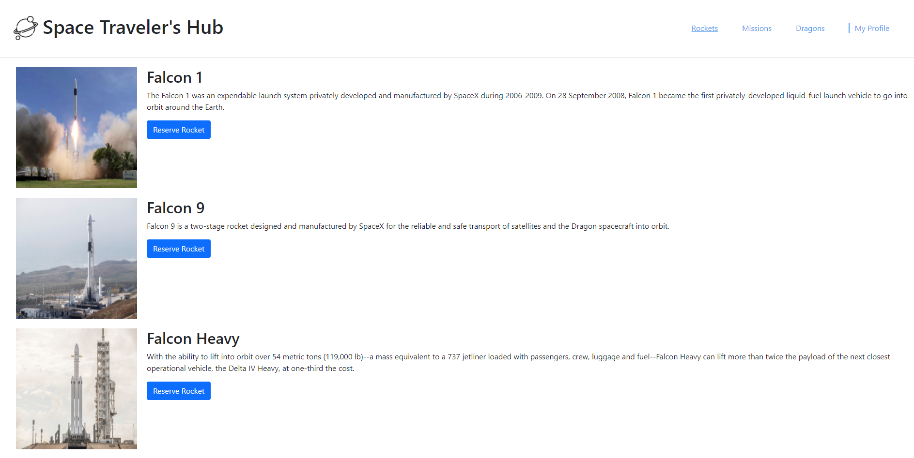
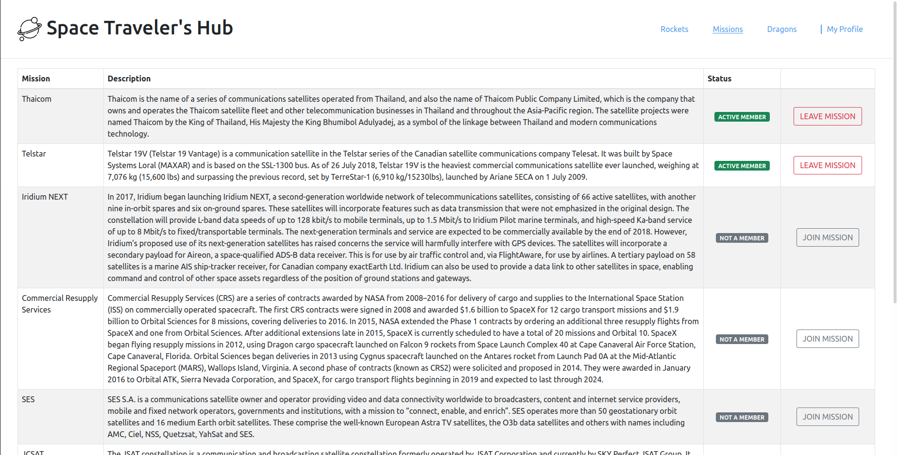
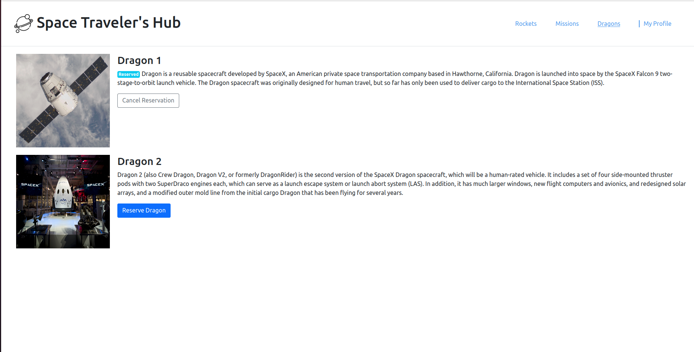

# Space Travellers Hub

> Space Travellers Hub is a single page web application that consumes Space X's API. It lists Space X's missions, rockets and dragons on different routes of the page.

>   

Users can interact with the app by joining and canceling missions, reserve or cancel dragons and rockets.

## Languages

- HTML/CSS
- JavaScript

## Technologies

- React Bootstrap
- React
- Redux

## Live Demo

[Demo](https://spacetravelers-hub.herokuapp.com/)

## Getting Started

To get a local copy up and running follow these simple example steps.

### Setup

1.  Open a terminal, navigate to the directory that you would like to clone the repository into using commands like:
    - `cd /pathname` to change your working directory.
2.  Next, clone the remote repository and create a local copy on your machine using this command:
    - `git clone https://github.com/afizsavage/spacetravelers-hub`
3.  Now you can see the contents of the remote repository on your machine by moving into the newly cloned directory:
    - `spacetravelers-hub`
    - `ls -la`
4.  run `npm install` on the command line to download all dependency packages.

### Run

1. run `npm run build` Builds the app for production to the `build` folder.\.
2. run `npm start` to start the application in production mode.

## Authors

👤 **Afiz Savage**

- GitHub: [@afizsavage](https://github.com/afizsavage)
- Twitter: [@fizzo_geek](https://twitter.com/fizzo_geek)
- LinkedIn: [@Afiz](https://www.linkedin.com/in/afiz-savage-3b91a21ba/)

👤 **Fikerte Tesfaye**

- GitHub: [@Fikerte-T](https://github.com/Fikerte-T)
- LinkedIn: [@fikerte-tesfaye](https://www.linkedin.com/in/fikerte-tesfaye/)

👤 **SadiQ HabiL**

- GitHub: [@kingqabil](https://github.com/kingqabil)
- Twitter: [@kingqabil](https://twitter.com/kingqabil)
- LinkedIn: [@kingqabil](https://linkedin.com/in/kingqabil)

## Show your support

Give a ⭐️ if you like this project!
